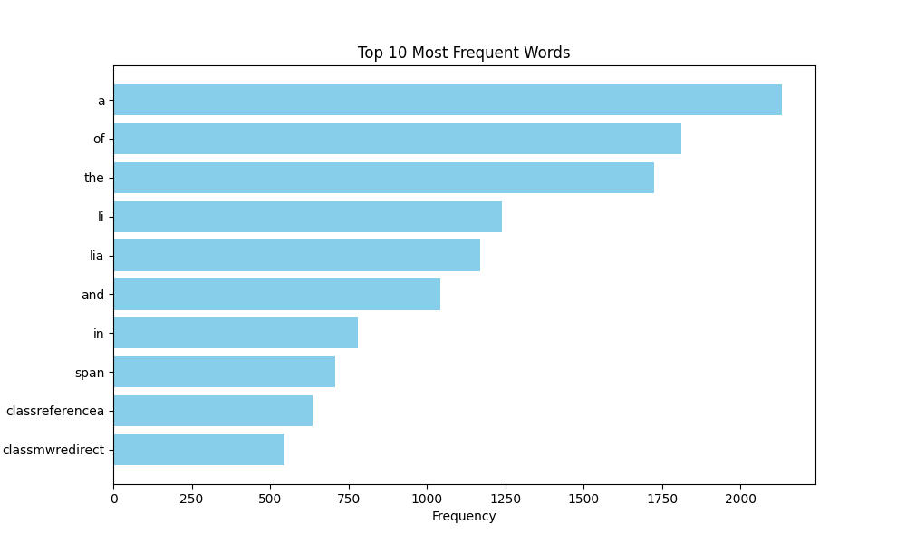

# goit-algo2-hw-06
The repository for the 6th GoItNeo Design and Analysis of Algorithms homework

### Task: 
Write a Python script that downloads text from a given URL, analyzes the word frequency in the text using the MapReduce paradigm, and visualizes the top words with the highest frequency in the text.

#### Step-by-step instruction

1. Import the necessary modules (matplotlib and others).

2. Take the MapReduce implementation code from the notes.

3. Create a function visualize_top_words to visualize the results.

4. In the main block of code, retrieve the text from the URL, apply MapReduce, and visualize the results.

#### Requirements:
1. The code successfully downloads text from the specified URL.

2. The code correctly performs word frequency analysis using MapReduce.

3. The visualization displays the top words by frequency of use.

4. The code effectively utilizes multithreading.

5. The code is readable and adheres to PEP 8 standards.

#### Results:

